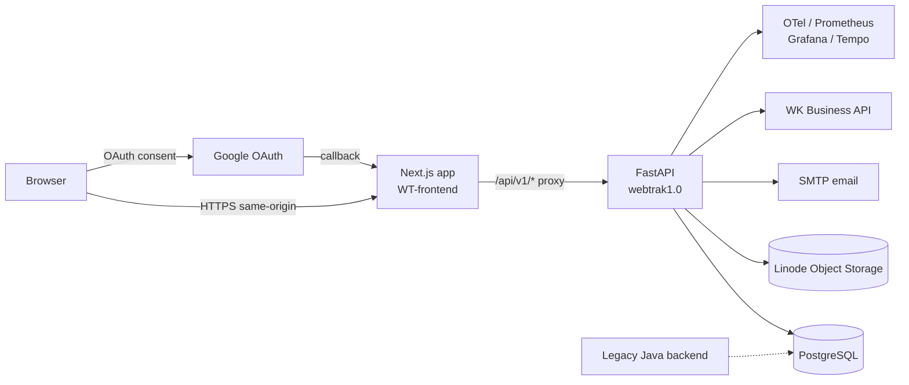
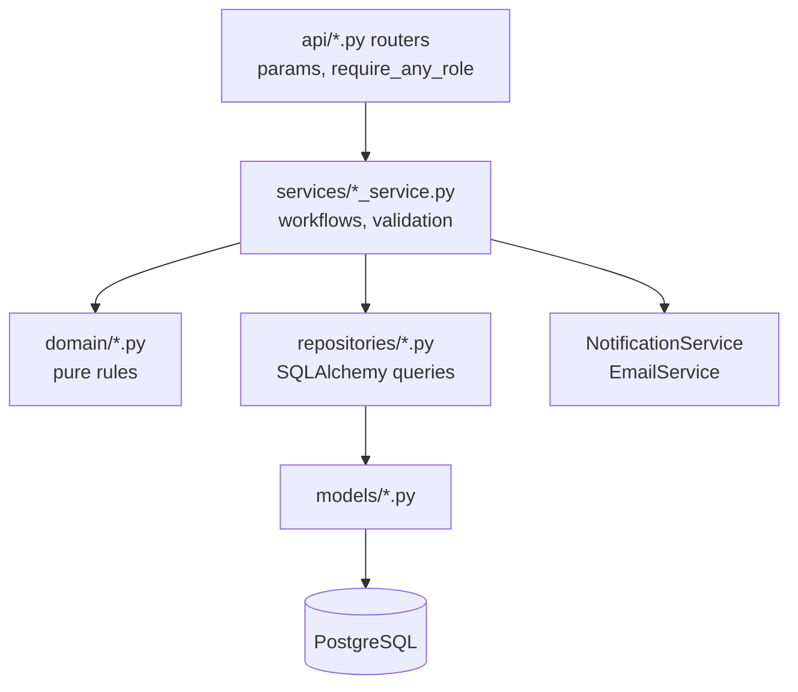
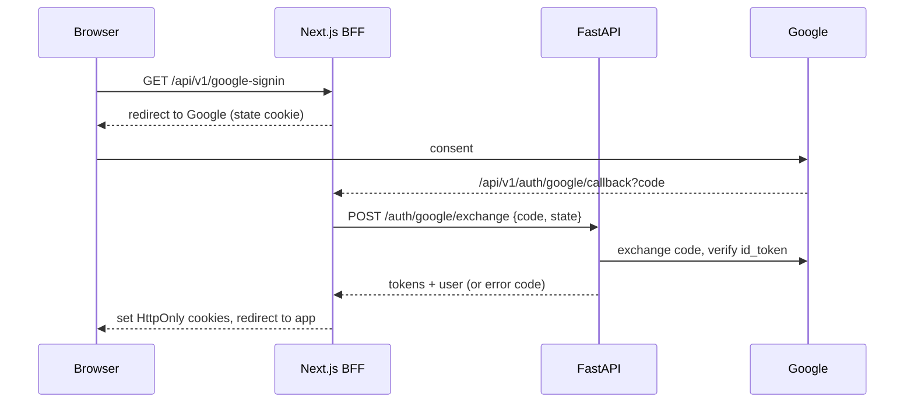
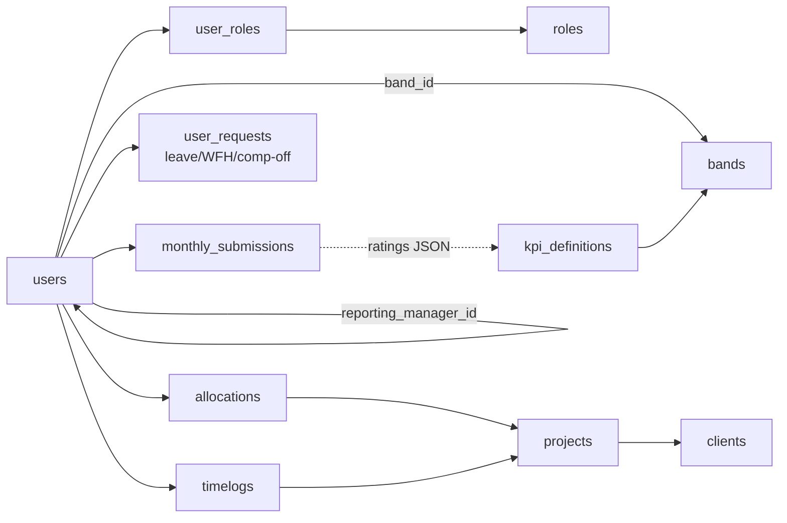
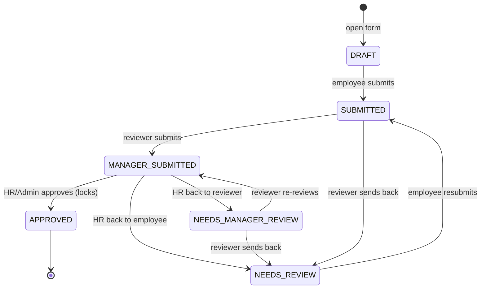

# WebTrak — Architecture & Design

As of 24 Sep 2026. Covers both codebases: **WT-frontend** (Next.js) and **webtrak1.0** (FastAPI). The same file lives at `docs/ARCHITECTURE.md` in each repo — update both together.

## Overview

WebTrak is Webknot's internal HR and workforce platform: a Next.js web app (WT-frontend) backed by a FastAPI service (webtrak1.0) on PostgreSQL. It covers the employee lifecycle from onboarding to offboarding, time off, timesheets, project allocation, learning, assets, policies and Pulse performance reviews.

webtrak1.0 is a Python rewrite of a legacy Java/Spring backend. It keeps that backend's API contracts and shares its database tables, so both can run against the same data during migration.

| Codebase | Stack | Size (Sep 2026) |
| --- | --- | --- |
| WT-frontend | Next.js 16.2 (App Router, Turbopack), React 19.2, TanStack Query 5, Tailwind 4, TypeScript | 34 dashboard modules, ~360-line endpoint registry |
| webtrak1.0 | FastAPI, SQLAlchemy 2 (async, asyncpg), Pydantic, Alembic, APScheduler, httpx | 40 routers, ~323 routes, 56 models, 89 migrations, 146 test files |

**Users and roles**

| Role | What they do |
| --- | --- |
| Employee (`ROLE_EMPLOYEE`) | Self-service: profile, leave/WFH/comp-off, timelog, allocations, learning, Pulse self-review. Every user holds this role. |
| Manager / DM (`ROLE_MANAGER`, `ROLE_DM`) | Approve team requests and timesheets, review direct reports' Pulse submissions |
| Account Manager (`ROLE_AM`) | Client and opportunity views |
| Finance (`ROLE_FINANCE`) | Finance-facing reports |
| HR (`ROLE_HR`) | Onboarding, directory, masters, policies, Pulse administration and final approval |
| Admin (`ROLE_ADMIN`) | Everything HR can do plus system administration; reviews HR members' Pulse submissions |

**Goals:** one source of truth for people data, role-scoped self-service, auditable approval workflows, and API parity with the legacy backend during migration.

## System context

The browser only ever talks to the Next.js app on its own origin; Next.js proxies every `/api/v1/*` call to FastAPI, which owns all business logic and the database. This same-origin "backend for frontend" (BFF) keeps auth cookies HttpOnly on the frontend domain.



Reading it: solid arrows are runtime calls; the dotted line is the legacy Java backend that shares the same tables during migration.

| External system | Used for | Config |
| --- | --- | --- |
| Google OAuth 2.0 | Sign-in (authorization code flow) | `GOOGLE_CLIENT_ID`, `GOOGLE_CLIENT_SECRET`, redirect URIs |
| PostgreSQL | System of record | `DATABASE_URL` |
| Linode Object Storage (S3 API) | Holiday calendar spreadsheets, personal annual calendars | `LINODE_OBJECT_STORAGE_*` |
| SMTP | Transactional and notification email; non-prod redirects to test inboxes | `SMTP_*`, `SMTP_DEV_REDIRECT_EMAIL` |
| WK Business API | Syncs clients, projects and opportunities | `WK_BUSINESS_*` (off by default) |
| OpenTelemetry stack | Metrics (`/metrics`), traces, dashboards | `observability/` docker-compose |

## Frontend architecture (WT-frontend)

The frontend is a thin client: route files only compose feature components, and every data call goes through one typed service layer to the same-origin `/api/v1` proxy.

```mermaid
flowchart LR
  P[app/**/page.tsx<br/>thin routes] --> C[components/{module}<br/>*PageClient]
  C --> H[hooks / TanStack Query]
  H --> S[services/hrms.service.ts]
  S --> E[api/endpoints.ts]
  S --> HC[api/httpClient.ts]
  HC --> BFF[app/api/v1/[...path]<br/>BFF proxy]
  BFF --> BE[FastAPI]
```

| Layer | Location | Responsibility |
| --- | --- | --- |
| Routing | `src/app/(protected)/dashboard/{module}/page.tsx` | Thin pages; heavy clients lazy-loaded via `lazyPages.tsx` (`next/dynamic`) |
| Route guard | `middleware.ts` | Redirects to `/login` without a session cookie; remembers the deep link across the OAuth round-trip |
| Feature UI | `src/components/{module}/` | Page clients, panels, dialogs; shared UI in `components/ui` and `components/dashboard/ui` |
| Data fetching | `src/hooks/*`, TanStack Query (75 files), small file-local `useLoad` hooks (15 files) | Caching, invalidation after mutations |
| API access | `src/services/hrms.service.ts` | One method per backend call; typed with `src/types/*` |
| HTTP plumbing | `src/api/httpClient.ts`, `endpoints.ts`, `error.ts` | Base URL, JSON parsing, silent token refresh on 401, typed `ApiError` |
| BFF routes | `src/app/api/v1/[...path]`, `auth/*`, `google-signin`, `holiday-calendar-storage` | Proxy to `API_BASE_URL`; own handlers for OAuth callback, refresh, logout, activity |
| Auth state | `context/AuthContext.tsx`, `lib/auth.ts` | Current user and roles; session idle/expiry timers |
| Navigation | `constants/dashboardNavigation.ts`, `routes.ts` | Role-filtered sidebar (32 role-scoped entries) |

**Base URL rule:** in production the client always calls same-origin `/api/v1/*`. In local dev, `NEXT_PUBLIC_API_BASE_URL` may point straight at FastAPI (`http://localhost:8080`) to skip the proxy.

**Conventions:** types in `src/types`, constants in `src/constants`, pure helpers in `src/utils`, dates exchanged as `dd/mm/yyyy` (see Cross-cutting). Folder-level conventions: `WT-frontend/src/ARCHITECTURE.md`.

## Backend architecture (webtrak1.0)

The backend is a strictly layered FastAPI app: routers handle HTTP and role checks, services hold every business rule, repositories own all SQL, and `domain/` holds pure rules with no I/O.



| Layer | Location | Rules |
| --- | --- | --- |
| Routers | `app/api/` (40 modules, all mounted under `/api/v1` in `app/main.py`) | Parse input, call `require_any_role`, return a Pydantic model or `GenericResponse{message, data}` |
| Services | `app/services/` | Business rules and orchestration; raise `HTTPException` with a stable `detail` code |
| Domain | `app/domain/` (35 modules, e.g. `kpi_score`, `review_cycles`, `leave_accrual_policy`, `date_utils`) | Stateless, unit-testable, no DB or HTTP |
| Repositories | `app/repositories/` | All queries; `db.session()` for reads, `db.tx()` for writes |
| Models / schemas | `app/models/` (56), `app/schemas/` | ORM tables; Pydantic DTOs built on `ApiModel` (dates rendered `dd/mm/yyyy`) |
| Core | `app/core/` | Settings, async DB engine, JWT security, circuit breaker, telemetry, migrations bootstrap |
| Middleware | `app/middleware/` | `MetricsMiddleware` (outermost) → `RequestLoggingMiddleware` → `ActorRolesMiddleware`, plus CORS |
| Jobs | `app/jobs/scheduler.py` | APScheduler, started on app startup |

**Request pipeline:** CORS → metrics → request logging → actor roles (decodes the JWT once per request) → router → service. A catch-all exception handler returns JSON `detail` rather than a bare 500, so the UI never shows a misleading "Unable to reach the server".

**API surface:** about 323 routes. OpenAPI is served at `/docs` and `/openapi.json` (alias `/api-docs`), with three documented security schemes: `BearerAuth` (user JWT), `IntegrationApiKey` (`wtint_…`) and `WebtrakAppKey` (`wtak_…`, managed from `/api/v1/admin/api-keys`). Read-only machine endpoints live under `/api/v1/integrations`.

**Doc drift:** `CODEBASE.md` still describes an `app/tools/` layer; that layer no longer exists and routers call services directly.

## Authentication, sessions and authorization

Users sign in only with Google. The Next.js BFF runs the OAuth callback, FastAPI verifies the Google identity against the users table, and the session lives in HttpOnly cookies on the frontend domain.



**Sign-in rules** (`AuthService.oauth_login_from_google_code`):

- Registered user, any email domain → signed in, unless their status blocks login (`account_inactive`).
- Unregistered, outside `COMPANY_EMAIL_DOMAIN` → `unauthorized_email_domain`.
- Unregistered, with `OAUTH_AUTO_CREATE_USER=false` → `unregistered_user`.
- `GET /api/v1/oauth/bypass/{email}` is a dev-only login, blocked when `APP_ENV=prod`.

| Session setting | Default | Meaning |
| --- | --- | --- |
| Access token (JWT, HS256) | 30 min | Sent as `accessToken` cookie or `Authorization: Bearer` |
| Refresh token | 7 days | Rotated on `POST /auth/refresh`; the client refreshes silently on 401 |
| Inactivity timeout | 240 min | The client pings `/auth/activity`; idle sessions are ended on refresh |
| Absolute max | 168 h | Backstop for abandoned tabs |

**Authorization** is role-based and enforced on the server in every router via `require_any_role(request, {...})`. Roles come from the signed JWT, never from the unsigned `roles` cookie. It returns 401 with no session (never 403, which would trigger a refresh storm) and 403 for a wrong role or an inactive account. Services then apply data-level rules, for example a manager may only review their direct reports, and nobody may review or approve their own submission.

**Frontend guards** are for user experience only: `middleware.ts` redirects to `/login` without a session cookie, and the sidebar hides modules by role. The backend remains the authority.

## Data model

Everything hangs off `users`: a person has one band, one reporting manager (a self-reference), one holiday calendar and many roles, allocations, requests, time logs and review submissions. There are 56 ORM models, managed by 89 Alembic migrations.



Reading it: arrows are foreign keys; the dotted line is a soft reference, because Pulse ratings store KPI ids inside JSON text.

| Domain | Main tables |
| --- | --- |
| People | `users`, `user_profile`, `user_roles`, `roles`, `bands`, `designation`, `user_type_transition`, `refresh_token` |
| Time off | `user_request`, `user_request_tracking`, `leave_mapping`, `leave_transaction`, `comp_off_grant`, `comp_off_usage`, `comp_off_approval`, `optional_leave_pair`, `holiday_calendar`, `holiday_calendar_day`, `annual_calendar` |
| Work | `projects`, `clients`, `opportunity`, `allocations` (+ role, type and location overrides), `allocation_extension_request`, `timelog` |
| Performance (Pulse) | `monthly_submissions`, `kpi_definitions`, `webknot_value`, `certification`, `submission_cycles`, `pulse_score_settings` |
| Learning | `training`, `training_session`, `training_participant`, `training_attendance`, `training_assessment`, `training_material`, `training_trainer`, `training_withdrawal_request` |
| Lifecycle | `attrition`, `exit_interview_response`, `exit_survey_token`, `background_verification`, `referral` |
| Assets and documents | `asset`, `asset_assignment`, `document`, `policy_document`, `policy_recipient`, `wiki_page` |
| Platform | `notification`, `api_key` |
| Engagement | `celebration_reaction` — see `docs/EMPLOYEE_ENGAGEMENT_FEATURES.md` |

**Key conventions**

- **Shared schema with the legacy Java backend.** Some tables, including `monthly_submissions`, predate this app, so their JSON columns and legacy `status` values must stay compatible.
- **Status strings, not enums.** `users.status`, `users.user_type`, request and review statuses are validated strings. Allowed values live in `app/domain/*`.
- **Timestamps.** New columns use `timestamptz`; naive values are treated as UTC. Some older columns are naive `DateTime`.
- **Migrations.** Alembic runs through `app/core/alembic_bootstrap.py` and `docker-entrypoint.sh` on deploy.

## Functional modules

Each business area is a vertical slice: a dashboard route and page client on the frontend, and a router, service and repositories on the backend.

| Module | Frontend route (`/dashboard/…`) | Backend routers | Key behavior |
| --- | --- | --- | --- |
| Onboarding and directory | `employee-directory`, `employee`, `profile`, `colleague`, `uploads` | `employee`, `role` | Onboard invite, bulk CSV upload, profile edits, user-type transitions (Intern / Consultant / Full-time) with band and designation checks, can be future-dated |
| Leave, WFH, comp-off | `leave`, `comp-off`, `whos-out`, `annual-calendar`, `holiday-calendars` | `leave_request`, `user_request`, `wfh`, `comp_off`, `optional_leave`, `holiday_calendar(_storage)`, `annual_calendar`, `whos_out` | Primary and secondary manager approval, balances and accrual, LOP, optional holidays, holiday calendars stored in Linode |
| Timesheets | `timelog` | `timelog` | Weekly logging per project, manager approval, reminders for missing logs |
| Projects and allocation | `allocation`, `allocation-extension`, `my-allocations`, `clients` | `project`, `allocation`, `allocation_extension`, `client`, `opportunity` | Allocations with % capacity, bench / Talent Pool, extension requests, WK Business sync |
| Learning | `learning-development` | `learning` | Trainings, sessions, attendance, assessments, withdrawals |
| Assets | `assets`, `my-assets` | `assets` | Asset register, assignment, QR codes |
| Policies and wiki | `policies` | `policy`, `wiki` | Send policies, track viewed and signed, reminders |
| Exit and lifecycle | `offboarding`, `exit-interview`, `background-verification`, `referral` | `attrition_reporting`, `exit_interview`, `bgv`, `referral`, `jobs` | Offboarding, exit survey by token link, BGV, referrals |
| Pulse | `pulse` | `monthly_submissions`, `reference` (masters) | Monthly KPI self-review → manager → HR approval (next section) |
| Reports | `reports`, `overview`, `home` | `reporting`, `leave_reporting`, `search`, `celebrations` | Utilization, workforce, LOP, skills; dashboard widgets |
| Compliance | `compliance` | `compliance` | Paginated, categorized nudges for missing documents/personal info and pending exit surveys (HR/Admin) — `docs/COMPLIANCE_NUDGES.md` |
| Engagement | `home` (widget grid) | `celebrations` | Success confetti, today's-celebration reactions, a movable/resizable/hideable Home dashboard — `docs/EMPLOYEE_ENGAGEMENT_FEATURES.md`, `docs/HOME_DASHBOARD_CUSTOMIZATION.md` |
| Masters and settings | `masters`, `settings`, `apps` | `reference`, `api_key`, `integrations`, `scheduler` | Bands, designations, departments, API keys, manual job triggers |

The `resumes` module also has its own route (`/dashboard/resumes`), served by the employee router.

## Pulse (KPI self-review) design

Pulse runs one review per employee per month: the employee rates themselves, a reviewer rates the same KPIs, and HR/Admin approves, which locks the row and records a final score. One row lives in `monthly_submissions` per (user, month, submission type). The legacy Java design this was ported from is described in `webtrak1.0/docs/KPI_SYSTEM_ANALYSIS.md`.



Reading it: states are `review_status` values. The legacy `status` column only ever holds `DRAFT`, `SUBMITTED`, `MANAGER_REVIEWED` or `APPROVED`, for Java compatibility.

**Who reviews whom**

| Submitter | Reviewer (manager step) | Final approval |
| --- | --- | --- |
| Employee whose reporting manager has MANAGER/DM | Reporting manager | Any HR/Admin except the submitter |
| Employee whose manager lacks that role, or has no manager | Any HR/Admin, from the Manager Reviews tab | Any HR/Admin except the submitter |
| HR team member | The Admin they pick at submit; only that Admin sees it | Any HR/Admin except the submitter |

**Rules enforced on the server**

- The employee may edit only in `DRAFT` or `NEEDS_REVIEW`; a resubmission clears the previous review round.
- Projects: pick 1–3 of your current allocations, or none if you are on the bench. Certifications must be active catalog entries, each counted once.
- Applicable KPIs are matched on band + department + designation (`Unspecified` = all). Legacy "Project / Account / Delivery Manager" map to "Manager".
- **Submission windows** (`submission_cycles`): GLOBAL, EMPLOYEE and MANAGER. A scope is open if its own window or GLOBAL is open. Drafts, submits and manager reviews return 403 when their window is closed. Window times are entered in IST.

**Scoring** (`app/domain/kpi_score.py`, same as the legacy Java calculator):

```
final = 0.9·K + 0.1·V + b(certifications)·0.9K + b(recognitions)·0.9K

b(n) = 0      when n = 0
       0.05   when 1 ≤ n ≤ 3
       0.10   when n > 3
```

Here K is the weighted KPI average and V the values average, each clamped to 1–5 and rounded to one decimal; the manager's ratings replace the employee's when present. The numbers shown (90/10 split, 5%/10% bonus tiers after 3, promotion at 4.0) are the defaults.

**Score settings:** HR/Admin tune the KPI/values split, both bonus tiers and the promotion threshold under **Settings → Pulse scoring** (`GET/PUT/DELETE /api/v1/masters/pulse-score-settings`, single-row table `pulse_score_settings`; no row = defaults). Changes apply to scores computed from then on; approved scores are not recalculated. HR may override a final score on approve, up to the highest score the current settings can produce. Per-KPI weightage is set on each KPI definition.

**Notifications** go out at every hand-off (in-app plus email): submitted → reviewer; reviewed → HR/Admin; sent back → employee or reviewer; approved → employee with the score.

## Cross-cutting concerns

Four conventions apply to every module: notifications never block a save, background work runs in one in-process scheduler, errors return stable codes, and dates cross the API as `dd/mm/yyyy` in IST.

**Notifications and email**

- `NotificationService` writes an in-app row, pushes it on the live stream, and, for types in `_COMPANION_EMAIL_TYPES`, sends an email in the background. Users can opt out of email in their preferences.
- Workflows with rich mail (leave, WFH, comp-off, onboarding) send their own templates and are excluded from companion email, so nobody gets duplicates.
- `EmailService` uses SMTP behind a circuit breaker. Outside prod it redirects every recipient to `SMTP_DEV_REDIRECT_EMAIL`. HR-triggered resends are rate-limited (`HR_EMAIL_COOLDOWN_MINUTES`, `HR_EMAIL_DAILY_CAP`).
- A notification failure is logged and swallowed; it never rolls back the business action.

**Scheduled jobs:** 22 APScheduler jobs start with the app (`ENABLE_SCHEDULER`; timezone `SCHEDULER_TIMEZONE`, default `APP_TIMEZONE` = Asia/Kolkata, so job hours are IST). Each job gets a 1-hour misfire grace window, and every run logs `[scheduler] job=<id> STARTING` → `COMPLETED … result=…` or `FAILED` (startup logs each job's next run). They can also be triggered manually through the `scheduler` router.

| Area | Jobs |
| --- | --- |
| People lifecycle | apply future-dated user-type transitions, internship completion, finalize or revert notice periods, reconcile stale manager roles, birthday wishes |
| Time off | monthly leave roll-up, daily leave reminders, auto-approve leave / WFH after 24 h, month-end and monthly LOP reports to HR |
| Work | timelog default reminders (every 3 days), timelog auto-approve after 24 h, deallocation, allocation-ending reminders |
| Other | policy pending marking (hourly), training deadlines, exit interview reminders, monthly skill-rating reminder, notification cleanup, referral ATS scoring worker |

**Errors:** services raise `HTTPException` with a machine-readable `detail` (for example `account_inactive`, `unregistered_user`); validation errors and uncaught exceptions are turned into JSON by global handlers. The frontend maps codes to messages (`oauthErrorMessages`, `toUserFriendlyApiErrorMessage`).

**Dates and time zones:** the API exchanges `dd/mm/yyyy` and `dd/mm/yyyy HH:MM:SS` (`ApiDate`, `ApiDateTime`). The business zone is `APP_TIMEZONE` (Asia/Kolkata): timestamps are stored in UTC and rendered in IST, "today" and "current month" use IST, and user-entered times are read as IST.

**Observability:** Prometheus metrics at `/metrics`, liveness at `/livez`, readiness at `/readyz`, health at `/health` and `/health/dependencies`, and OpenTelemetry traces to Tempo with Grafana dashboards (`observability/` compose stack).

## Deployment and configuration

Each codebase ships as one Docker image (`webtrak-frontend`, `webtrak-backend`, tagged per environment, e.g. `:uat`). The backend applies database migrations on every container start before serving traffic.

| Image | Build | Runtime |
| --- | --- | --- |
| Frontend | `node:22-alpine`, 3 stages (deps → builder → runner), pnpm 9.15.9, `pnpm build` (Next.js production build with TypeScript check) | `pnpm start` on port 3000 |
| Backend | `python:3.12-slim`, `pip install -r requirements.txt`, runs as non-root `appuser` | `docker-entrypoint.sh`: `alembic upgrade head`, then `uvicorn app.main:app` on port 8080 |

**Environments:** develop (`webtrak.webknot-dev.in`, API `webtrak-api.webknot-dev.in`) and UAT, plus local dev. The compose file that builds the `:uat` images is not in either repo.

**Key configuration**

| Variable | Where | Purpose |
| --- | --- | --- |
| `API_BASE_URL` | Frontend (server) | Upstream FastAPI for the BFF proxy; required in every deployed environment |
| `NEXT_PUBLIC_API_BASE_URL` | Frontend | Empty in prod (same-origin); may point at FastAPI in local dev |
| `APP_URL` | Frontend | Public origin for OAuth redirect URIs |
| `DATABASE_URL`, `DB_POOL_SIZE`, `DB_MAX_OVERFLOW` | Backend | PostgreSQL connection and pool (defaults 5 + 5) |
| `JWT_SECRET` | Backend | Token signing (default `replace_me` must be overridden) |
| `GOOGLE_CLIENT_ID`, `GOOGLE_CLIENT_SECRET`, `GOOGLE_OAUTH_REDIRECT_URIS` | Backend | OAuth |
| `FRONTEND_REDIRECT_URI`, `CORS_ORIGINS` | Backend | Allowed browser origins and callback hosts |
| `COMPANY_EMAIL_DOMAIN`, `OAUTH_AUTO_CREATE_USER` | Backend | Sign-in policy for unregistered users |
| `SMTP_*`, `SMTP_REDIRECT_NON_PROD` | Backend | Email delivery and non-prod redirection |
| `APP_TIMEZONE`, `SCHEDULER_TIMEZONE`, `ENABLE_SCHEDULER` | Backend | Business zone and job scheduling |
| `SESSION_INACTIVITY_MINUTES`, `SESSION_MAX_HOURS` | Both | Session policy (frontend copies are for display timers) |

**Build pipeline:** there is no CI config in either repo. Type errors surface only during `pnpm build` in the Docker build (as in the UAT build failure fixed on 23 Sep 2026), and backend tests are not run before images are built.

**Mismatch to fix:** the backend Dockerfile says `EXPOSE 8000`, but uvicorn listens on 8080.

## Quality, risks and roadmap

The biggest risk is that nothing checks a change before it reaches a Docker build: there is no CI, backend tests don't run in the pipeline, and frontend lint isn't enforced.

**Testing today**

| Area | State |
| --- | --- |
| Backend | 146 pytest files, mostly unit tests of services with fakes (`object.__new__` + `AsyncMock`); an `integration` marker needs a migrated database |
| Frontend | No automated tests; `tsc` runs only inside `next build`; ESLint shows 6 existing errors outside Pulse |
| End to end | Manual click-through per role |

**Known risks and gaps**

| Risk | Impact | Recommendation |
| --- | --- | --- |
| No CI pipeline | Type and test failures found at deploy time | Add CI: `tsc --noEmit`, `eslint`, `pnpm build`; `pytest` on Python 3.12 against a throwaway Postgres |
| Shared DB with legacy Java backend | Schema or JSON-shape changes can break the other app | Record the shared tables and JSON contracts; retire the Java writers per module |
| Pulse ratings stored as JSON text | KPI ids aren't foreign keys; weights are resolved at read time | Move to `submission_kpi_ratings` tables once Java no longer writes the row |
| Scheduler runs in the API process | Jobs run on every replica if scaled out | Run jobs in one worker (or add a lock); check that only one `[scheduler] STARTED` line appears per deploy |
| Very large page clients (e.g. `UploadsPageClient.tsx` ~2,800+ lines) | Hard to change safely | Continue the documented extraction into `sections/`, hooks and utils |
| Stale docs | `README.md` still says only company-domain accounts may sign in; `CODEBASE.md` lists a removed `tools/` layer | Update both from this doc |
| Dockerfile port mismatch | `EXPOSE 8000` vs uvicorn 8080 | Align on 8080 |
| Self-reported Pulse recognitions | The count adds score points with no upper limit | Cap it, or have the manager confirm it |

**Roadmap (suggested order)**

1. CI for both repos, with branch protection on the deploy branch.
2. Fix the existing ESLint errors and make lint blocking.
3. Pin the scheduler to one instance and to IST.
4. Refresh `README.md` / `CODEBASE.md` and link this document from both.
5. Plan the legacy Java cut-over per module, then normalize Pulse storage.

**Open questions**

- Where does the UAT/prod compose and hosting configuration live, and who owns it?
- Is the legacy Java backend still writing to production tables, and for which modules?
